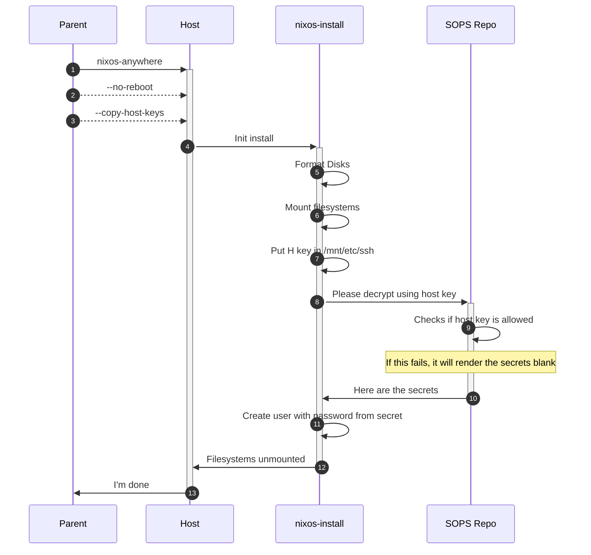

# General Instructions

## Adding a Host

I would prefer to use [nixos-anywhere](https://nix-community.github.io/nixos-anywhere/), but for now:

1. Install NixOS on the host using the `nixos-installer` as a _guide_
   1. Ensure that SSH keys have at least been added to root or kiss the install goodbye
1. After install, ssh into the new host and run `nix run nixpkgs#ssh-to-age -- -private-key -i /etc/ssh/ssh_H_ed25519_key.pub`
1. add the key to the secrets repo
1. Back in this repo, run `just secrets-update`
1. commit and push up
   1. TODO: Should this be a public repo?
1. get the repo onto the host
1. run `nix develop` in the repo on the host
1. run `just rebuild` for nixos or `just rebuild-darwin` for mac
   1. This is going to fail on user SOPS
   1. You will need to make sure that the user can get password'ed for the next part
1. ssh into the host as the user
1. run `just sops-init`
1. put that get in the secrets repo as user key
1. Back in this repo, run `just secrets-update` (again)
1. Get the changes onto the host
1. finally, run the rebuild again

## Problem

SOPS needs some kind of bootstrap. It works like this:

