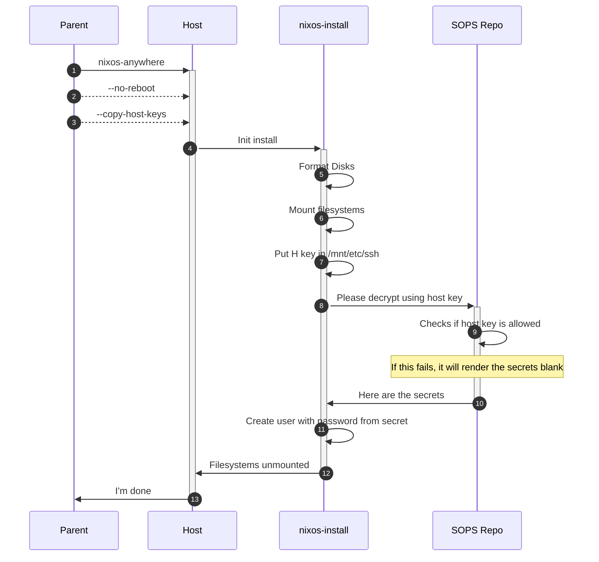
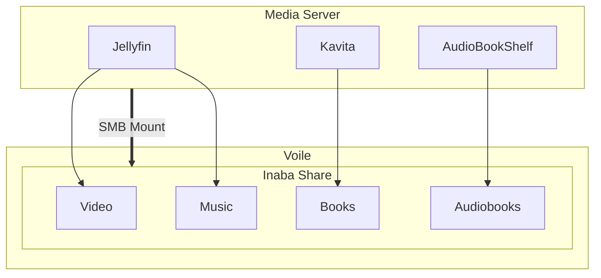

# General Instructions

## Structural Reference

See [EmergentMind's Documentation](original/anatomy.md)

[Sructure](structure.adoc)

## Adding a Host

I would prefer to use [nixos-anywhere](https://nix-community.github.io/nixos-anywhere/), but for now:

1. Install NixOS on the host using the `nixos-installer` as a _guide_
   1. Ensure that SSH keys have at least been added to root or kiss the install goodbye
1. After install, ssh into the new host and run `nix run nixpkgs#ssh-to-age -- -private-key -i /etc/ssh/ssh_H_ed25519_key.pub`
1. add the key to the secrets repo
1. Back in this repo, run `just secrets-update`
1. commit and push up
   1. TODO: Should this be a public repo?
1. get the repo onto the host
1. run `nix develop` in the repo on the host
1. run `just rebuild` for nixos or `just rebuild-darwin` for mac
   1. This is going to fail on user SOPS
   1. You will need to make sure that the user can get password'ed for the next part
1. ssh into the host as the user
1. run `just sops-init`
1. put that get in the secrets repo as user key
1. Back in this repo, run `just secrets-update` (again)
1. Get the changes onto the host
1. finally, run the rebuild again

## Problem

SOPS needs some kind of bootstrap. It works like this:

## Using Stylix and Base16

[Stylix](https://stylix.danth.me/) colors are provided in base16 format via `<homeConfigurations."user@host">.config.lib.stylix.colors`. The base16 colors are as follows:

### Base 16 Style guidelines

- base00 - Default Background
- base01 - Lighter Background (Used for status bars, line number and - folding marks)
- base02 - Selection Background
- base03 - Comments, Invisibles, Line Highlighting
- base04 - Dark Foreground (Used for status bars)
- base05 - Default Foreground, Caret, Delimiters, Operators
- base06 - Light Foreground (Not often used)
- base07 - Light Background (Not often used)
- base08 - Variables, XML Tags, Markup Link Text, Markup Lists, Diff - Deleted
- base09 - Integers, Boolean, Constants, XML Attributes, Markup Link Url
- base0A - Classes, Markup Bold, Search Text Background
- base0B - Strings, Inherited Class, Markup Code, Diff Inserted
- base0C - Support, Regular Expressions, Escape Characters, Markup Quotes
- base0D - Functions, Methods, Attribute IDs, Headings
- base0E - Keywords, Storage, Selector, Markup Italic, Diff Changed
- base0F - Deprecated, Opening/Closing Embedded Language Tags, e.g. `<?php ?>`

### Stylix Style guidelines

Using image colors for Starship. See the [general guidelines](https://stylix.danth.me/styling.html#images) for the colors.

- Background color: base00
- Alternate background color: base01
- Main color: base05
- Alternate main color: base04
- Red: base08
- Orange: base09
- Yellow: base0A
- Green: base0B
- Cyan: base0C
- Blue: base0D
- Purple: base0E
- Brown: base0F

## Media Server module concept
